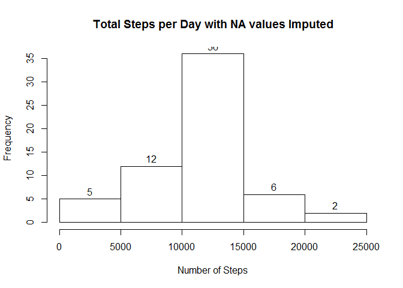

# Reproducible Research - Week2 - Course Project 1
Tanuj Mittal  
17 April 2017  


## A. Loading and preprocessing the data
### Objective 1 - Code for reading in the dataset and/or processing the data


```r
library(dplyr, quietly = TRUE, warn.conflicts = FALSE)
library(graphics, quietly = TRUE, warn.conflicts = FALSE)

dataUrl <- "https://d396qusza40orc.cloudfront.net/repdata%2Fdata%2Factivity.zip"
destFileName <- "ActMonData.zip"
csvFileName <- "activity.csv"

download.file(dataUrl, destfile = destFileName ,mode = "wb")
unzip(destFileName)

actData <- read.csv(csvFileName)
actData$date <- as.Date(actData$date,format = "%Y-%m-%d")
```
## B. What is mean total number of steps taken per day?
### Objective 2 - Histogram of the total number of steps taken each day


```r
dailySummary <- summarise(group_by(actData, date), sum(steps, na.rm = TRUE ))
names(dailySummary) <- c("Date", "Steps")
hist(dailySummary$Steps, main = "Total Steps per Day", xlab = "Number of Steps", ylab = "Frequency", labels = TRUE)
```

<!-- -->

### Objective 3 - Mean and Median Steps per day

```r
meanStepsPerDay <- mean(dailySummary$Steps, na.rm = TRUE)
medianStepsPerDay <- median(dailySummary$Steps, na.rm = TRUE)
```
**Mean steps** per day with NA values removed is 
    9354.23  
**Median steps** per day with NA values removed is 
    10395  

## C. What is the average daily activity pattern?
### Objective 4 - Average steps by 5 minute intervals across all days

```r
intervalAverage <- summarise(group_by(actData, interval), Steps = mean(steps, na.rm = TRUE ))

plot(x = intervalAverage$interval, 
        y = intervalAverage$Steps, 
        xlab = "Interval", 
        ylab = "Average Steps", 
        main = "Average steps per interval", 
        type = "l")
```

<!-- -->

### Objective 5 - The 5-minute interval that, on average, contains the maximum number of steps

```r
maxStepsPerInterval <- intervalAverage[intervalAverage$Steps == max(intervalAverage$Steps),]
```
**Interval with the maximum number of steps:**  
Interval: 835  
Steps: 206.17  

## D. Imputing Missing Values
### Objective 6 - Code to describe and show a strategy for imputing missing data
For imputing missing values we shall adopt a strategy where the missing number of
steps for an interval will be taken as the average number of steps for that 
interval across all observations.

```r
actDataImputed <- actData
actDataImputed <- merge(actDataImputed, intervalAverage, by = "interval")
idxNA <- which(is.na(actDataImputed$steps))
actDataImputed[idxNA,"steps"] <- actDataImputed[idxNA,"Steps"] 
```

### Objective 7 - Histogram of the total number of steps taken each day after missing values are imputed

```r
dailySummaryImputed <- summarise(group_by(actDataImputed, date), sum(steps, na.rm = TRUE ))
names(dailySummaryImputed) <- c("Date", "Steps")
hist(dailySummaryImputed$Steps, main = "Total Steps per Day with NA values Imputed", xlab = "Number of Steps", ylab = "Frequency", labels = TRUE)
```

<!-- -->

```r
meanStepsPerDayImputed <- mean(dailySummaryImputed$Steps, na.rm = TRUE)
medianStepsPerDayImputed <- median(dailySummaryImputed$Steps, na.rm = TRUE)
```
**New Mean steps** per day with imputed data: 10766.19  
**New Median steps** per day with imputed data: 10766.19

### Objective 8 - Panel plot comparing the average number of steps taken per 5-minute interval across weekdays and weekends

```r
weekdaysVector <- c("Monday", "Tuesday", "Wednesday", "Thursday", "Friday")
actDataImputed$WeekDayOrEnd <- factor((weekdays(actDataImputed$date) %in% weekdaysVector), 
                                      levels = c(TRUE,FALSE), 
                                      labels = c("Weekday","Weekend"))

actDataImputedByWeekDayEndByInt <- actDataImputed %>% group_by(WeekDayOrEnd, interval) %>% summarize(MeanSteps = mean(steps))

actDataImputedByWeekDayByInt <- filter(actDataImputedByWeekDayEndByInt,WeekDayOrEnd == "Weekday")
actDataImputedByWeekendByInt <- filter(actDataImputedByWeekDayEndByInt,WeekDayOrEnd == "Weekend")

par(mfrow=c(2,1), mar = c(4,4,1,1)) 
plot(x = actDataImputedByWeekDayByInt$interval, 
                    y = actDataImputedByWeekDayByInt$MeanSteps, 
                    xlab = "Interval", 
                    ylab = "Average Steps", 
                    main = "Weekday", 
                    type = "l")

plot(x = actDataImputedByWeekendByInt$interval, 
                    y = actDataImputedByWeekendByInt$MeanSteps, 
                    xlab = "Interval", 
                    ylab = "Average Steps", 
                    main = "Weekend", 
                    type = "l")
```

<!-- -->

